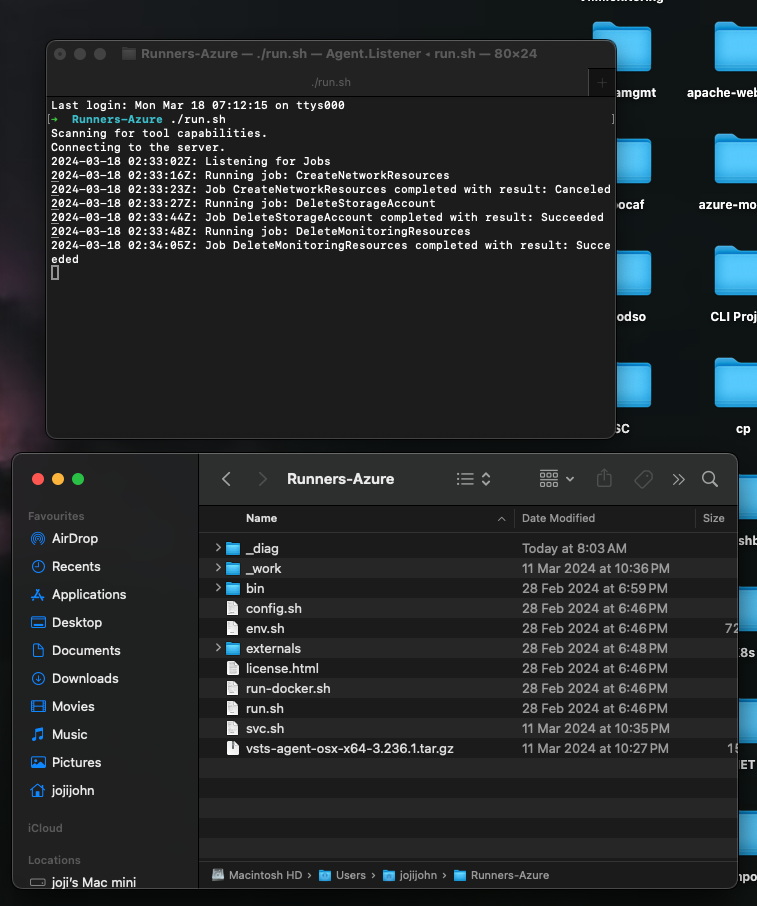

# Azure VM Monitoring Solution

This document provides an overview of the Azure VM Monitoring Solution, which enables you to monitor the health and performance of your Azure virtual machines (VMs) using Azure native resources and a CI/CD process with Azure DevOps.

## Table of Contents
1. [Overview](#overview)
2. [Prerequisites](#prerequisites)
3. [Architecture](#architecture)
4. [Setup and Configuration](#setup-and-configuration)
5. [Conclusion](#conclusion)

## Overview
The Azure VM Monitoring Solution allows you to collect and analyze important metrics and logs from your Azure VMs to ensure their health and performance. By leveraging Azure native resources such as Log Analytics Workspace and Azure Monitor, along with a CI/CD process using Azure DevOps, you can automate the deployment and configuration of the monitoring components.

## Prerequisites
Before getting started, ensure you have the following prerequisites:
- An Azure subscription with sufficient permissions to create and manage resources
- An Azure DevOps organization and project
- Basic knowledge of Azure services and Azure DevOps pipelines

## Architecture
The solution architecture consists of the following components:
- Azure VMs: The virtual machines that you want to monitor.
- Log Analytics Workspace: A centralized repository for collecting and analyzing logs and metrics from the VMs.
- Azure Monitor: A comprehensive monitoring service in Azure that helps you collect, analyze, and act on telemetry data from your Azure resources.
- Azure DevOps: A cloud-based platform for managing your development lifecycle, including CI/CD pipelines.

## Setup and Configuration
### Create Azure Resources
- Create a Log Analytics Workspace to store the collected logs and metrics from the VMs.
- Create a virtual network and subnet to host the VMs.
- Create Windows VMs and associate them with the virtual network and subnet.
- Create a storage account to store diagnostics data.
- You can automate the creation of these resources using Azure DevOps pipelines and PowerShell scripts.

### Configure Azure DevOps Pipeline
- Set up an Azure DevOps pipeline to automate the deployment and configuration of the monitoring solution.
- Define variables for resource names, locations, and other configuration settings.
- Create stages in the pipeline for creating network resources, VMs, monitoring resources, and cleaning up resources.
- Use Azure PowerShell tasks to execute PowerShell scripts for each stage.

### Enable Azure Diagnostics Extension
- Enable the Azure Diagnostics extension on the VMs to collect metrics and logs from the Azure platform level.
- Use the Set-AzVMDiagnosticsExtension cmdlet in a PowerShell script to enable the extension.
- Configure the diagnostics extension to send the collected data to the Log Analytics Workspace.
- Use a pipeline stage to execute the PowerShell script and enable the diagnostics extension on the VMs.

### Retrieve VM Metrics
- Create a PowerShell script to retrieve key VM metrics from the Log Analytics Workspace using the Azure Monitor REST API.
- Use the Invoke-RestMethod cmdlet to make API requests and retrieve metrics such as CPU usage, memory usage, disk usage, and network traffic.
- Process the API response and extract the relevant metrics for each VM.
- Use a pipeline stage to execute the PowerShell script and retrieve the VM metrics.

## Using a Mac Machine as the Agent

I am using a Mac machine as the agent and utilizing the Azure runner script to execute the Azure DevOps pipeline. This Azure runner script is a cross-platform tool that enables me to run the pipeline across different operating systems, including macOS. Before using the Azure runner script on my Mac machine, I installed PowerShell Core as a prerequisite, which is cross-platform. After these preparations, I was able to execute the Azure runner script to successfully run the pipeline and deploy the Azure VM Monitoring Solution.

## Conclusion
By following the steps outlined in this document, you can set up an Azure VM Monitoring Solution that leverages Azure native resources and a CI/CD process with Azure DevOps. This solution enables you to collect and analyze important metrics and logs from your Azure VMs, helping you ensure their health and performance.

Remember to regularly review and update your monitoring configuration to meet your evolving requirements and best practices.

For more detailed information and code examples, please refer to the provided PowerShell scripts and Azure DevOps pipeline configurations.

